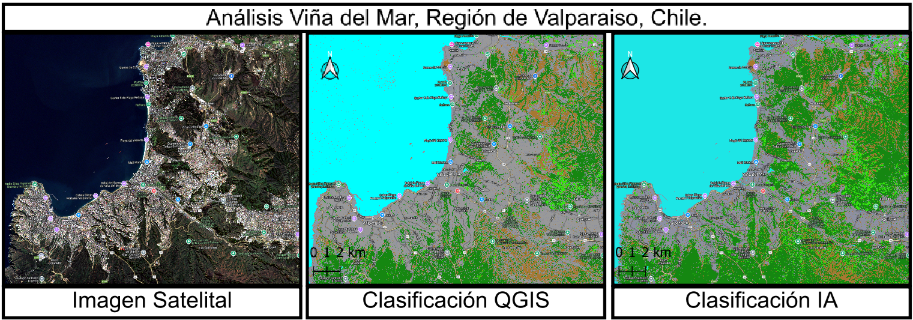
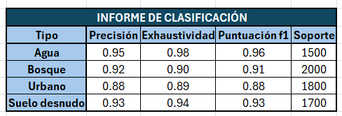

# AI-Land-Use-Classification
### Flujo DE trabajo, aprendizaje automático que utiliza QGIS y Python (Scikit-learn, Rasterio) para realizar una clasificación supervisada de imágenes satelitales Sentinel-2.
A Machine Learning workflow using QGIS and Python (Scikit-learn, Rasterio) to perform supervised classification of Sentinel-2 satellite imagery.

### Comparativa: IA (Random Forest) vs. QGIS (Máxima Verosimilitud)

Para evaluar la efectividad del modelo de Machine Learning, se realizó una comparación directa con un algoritmo de clasificación estadístico estándar disponible en QGIS (Máxima Verosimilitud), utilizando exactamente las mismas muestras de entrenamiento.

#### Análisis de Resultados

| Criterio | ⚠️ QGIS (Máxima Verosimilitud) | ✅ Mi Modelo IA (Random Forest)
| :--- | :--- | :--- |
| **Coherencia Contextual** | **Bajo.** Cometió un error crítico al clasificar partes del mar y la costa como "Urbano", probablemente confundiendo el brillo del sol o la arena mojada con hormigón[cite: 2327, 2328]. | **Superior.** El modelo no cometió errores lógicos graves. [cite_start]La clasificación del agua fue casi perfecta, sin confundirla con otras clases[cite: 2316, 2317]. | [cite_start]
| **Clasificación Urbana** | [cite_start]**Bueno (Visualmente).** El área urbana se ve más consolidada y expansiva, siendo visualmente más "agresivo" en su clasificación[cite: 2323, 2325]. | [cite_start]**Bueno.** Aunque la mancha urbana se mostró algo menos compacta, la clasificación fue contextualmente correcta[cite: 2321]. |
| **Conclusión General** |  [cite_start]**Menos Confiable.** Aunque visualmente efectivo en algunas áreas, el error fundamental de clasificar agua como ciudad lo hace un modelo menos fiable para un análisis profesional[cite: 2330]. | [cite_start]**Más Robusto y Confiable.** A pesar de entrenarse con pocas muestras, el modelo de IA demostró una comprensión más profunda de las firmas espectrales complejas, evitando resultados ilógicos y generando un mapa final más confiable[cite: 2331, 2335]. |

El análisis demuestra que, si bien las herramientas estándar de GIS son potentes, un modelo de IA personalizado como Random Forest puede lograr una mayor coherencia y fiabilidad, especialmente en paisajes complejos donde las firmas espectrales pueden ser ambiguas.

### Desafíos Superados
Durante el desarrollo, se solucionaron desafíos técnicos comunes en el procesamiento de datos geoespaciales a gran escala, como la gestión de errores `MemoryError` mediante el procesamiento por bloques y la resolución de problemas de compatibilidad de formatos entre QGIS y Python.

### Contacto
Si mi trabajo te parece interesante o tienes un desafío similar en tu organización, me encantaría conversar.
* **LinkedIn:** [Luis Vergara Morales](https://www.linkedin.com/in/luis-vergara-morales)

